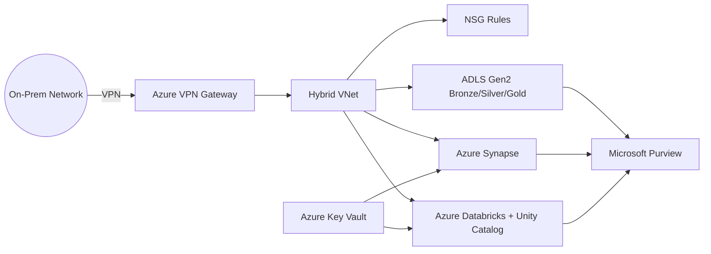

A **hybrid cloud security and governance project** built with **SSMS + Azure + Terraform**.  


This project demonstrates how to design and deploy a **secure-by-design hybrid architecture** by integrating **on-premises Microsoft SQL Server (with Always Encrypted & Transparent Data Encryption)** with **Azure data services**, while ensuring **GDPR/FADP compliance**, **data lineage**, and **end-to-end security controls**.


---

## 🚀 Project Goals
-  **Hybrid Connectivity** — Securely bridge on-prem networks with Azure using VPN Gateway & Local Gateway.  
-  **Data Security** — Enforce encryption (TLS 1.2, TDE, Always Encrypted), RBAC, NSG rules, and firewall policies.  
-  **Analytics & Processing** — Deploy **Azure Synapse** and **Databricks (Unity Catalog enabled)** for secure analytics.  
-  **Governance** — Implement **Microsoft Purview** for data cataloging, lineage, and compliance monitoring.  
-  **Data Lakehouse** — Provision **ADLS Gen2** with Bronze → Silver → Gold containers for structured governance.  
-  **Key Management** — Secure secrets and credentials with **Azure Key Vault**.  
-  **Compliance** — Support GDPR and FADP with audit logging, classification, and governance policies.  

---

## 🔒 Security & Compliance Features (updated)

### 🔑 Encryption
- TLS 1.2 enforced across services  
- Storage encryption at rest (AES-256)  
- Always Encrypted & **Transparent Data Encryption (TDE)** for Microsoft SQL / Synapse  
- Key Vault–managed secrets for SQL authentication and access  

### 🛂 Access Control
- Azure Key Vault secrets management  
- Role-Based Access Control (RBAC)  
- NSG inbound/outbound deny rules  
- Segregated public/private subnets  

### 🗂️ Governance
- Microsoft Purview scans for sensitive data  
- GDPR/FADP compliance tags on resources  
- Lineage tracking across Synapse & Databricks  

### 📜 Auditing
- Synapse + SQL auditing to ADLS `sqldbauditlogs` container  
- Extended auditing for compliance reporting  
- Security alert policies enabled  

## 📂 Repository Structure

```bash
HYBRID_SECURITY_BRIDGE/
├── modules/
│   ├── diagnostics/         # Centralized logging & monitoring setup
│   ├── key_vault/           # Azure Key Vault with RBAC + secrets
│   ├── local_gateway/       # Local on-prem gateway definition
│   ├── nsg_rules/           # NSG security rules (deny/allow)
│   ├── purview/             # Microsoft Purview governance account
│   ├── storage_account/     # ADLS Gen2 + Bronze/Silver/Gold containers
│   ├── synapse/             # Azure Synapse workspace with auditing
│   ├── vpn_gateway/         # Azure VPN Gateway for hybrid connectivity
│   └── defender/            # Security Center / Defender for Cloud configs
│
├── terraform/
│   ├── main.tf              # Root Terraform deployment
│   ├── variables.tf         # Input variables
│   ├── terraform.tfvars     # Custom environment values
│   ├── terraform.tfstate    # State file (local or remote backend)
│   └── outputs.tf           # Outputs for integration
│
├── template.json            # ARM deployment template
├── parameters.json          # ARM deployment parameters
└── README.md                # Project documentation
```

---

## 🏗️ Key Azure Resources Deployed

- **Networking**
  - Virtual Network (`hybrid-vnet`) with Public, Private, and Gateway subnets
  - VPN Gateway + Local Gateway
  - Network Security Group (`bridge-nsg`) with deny rules (e.g., `Deny-HR-IP`)
  - Static Public IP for VPN access

- **Storage**
  - ADLS Gen2 Storage (`securebridgestorage01`)
  - Containers: `bronze`, `silver`, `gold`, `metastore`, `sqldbauditlogs`, `synapsefs`

- **Data & Analytics**
  - Azure Synapse (`securebridgesynapse`) with auditing, TLS enforcement, and vulnerability assessments
  - Azure Databricks (`databrickswork`) with **Unity Catalog** enabled
  - Databricks Access Connector (`securebridge-access`)

- **Governance & Security**
  - Microsoft Purview (`securebridgepurview`) for lineage & classification
  - Azure Key Vault (`kv-securebridge`) with purge protection, RBAC, and secrets for SQL + Storage keys
  - Defender for Cloud configurations

---

## 🔒 Security & Compliance Features

- **Encryption**
  - TLS 1.2 enforced across services  
  - Storage encryption at rest (AES-256)  
  - Always Encrypted & TDE (SQL/Synapse)  

- **Access Control**
  - Azure Key Vault secrets management  
  - Role-Based Access Control (RBAC)  
  - NSG inbound/outbound deny rules  
  - Segregated public/private subnets  

- **Governance**
  - Microsoft Purview scans for sensitive data  
  - GDPR/FADP compliance tags on resources  
  - Lineage tracking across Synapse & Databricks  

- **Auditing**
  - Synapse auditing to ADLS `sqldbauditlogs` container  
  - Extended auditing for compliance reporting  
  - Security alert policies enabled  

---

## ⚙️ Deployment

### Option 1: Terraform

```bash
# Initialize Terraform
terraform init

# Validate configuration
terraform validate

# Apply deployment
terraform apply -var-file="terraform.tfvars"
```

### Option 2: ARM Deployment (az cli)

```bash
az login
az group create --name hybrid-secure-rg --location brazilsouth

az deployment group create   --resource-group hybrid-secure-rg   --template-file template.json   --parameters @parameters.json
```

---

## 📖 Use Cases

- ✅ Demonstrating **Hybrid Cloud Integration** with security best practices  
- ✅ Building a **GDPR/FADP-compliant data platform** for NGOs & enterprises  
- ✅ Showcasing **data lakehouse patterns** (Bronze → Silver → Gold)  
- ✅ Enabling **governed analytics** with Purview + Unity Catalog  
- ✅ Preparing for **Azure certifications** (AZ-104, DP-203, AI-900)  

---

## 🧭 Next Steps

- Automate Purview **classification rules** for PII/PHI  
- Extend **CI/CD pipelines** with Azure DevOps  
- Add **Defender for Cloud alerts** into monitoring stack  
- Build **Databricks/Synapse pipelines** using this secured foundation  

---

## 📌 Diagram



---

## 👤 Author

**Adriele Rocha Weisz**  
📍 Zurich, Switzerland  
🔗 [GitHub](https://github.com/rochaadrielea) | 🌍 [Portfolio](https://www.risingleaders.com.br/adrielerocha)  

---
